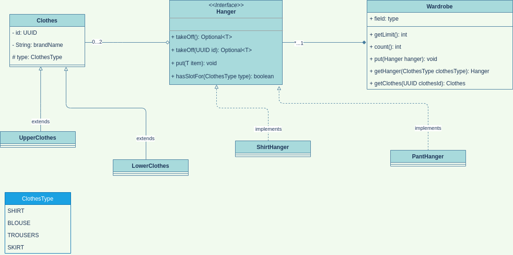

# OOP questions

## Software design

### Error handling

#### What does 'fail fast' mean in terms of exception handling? Why is it a good practice?
* In systems design, a **_fail-fast_** system is one which immediately reports at its interface any condition that is
 likely to indicate a failure. 
* **_Fail-fast_** systems are usually designed to stop normal operation rather than attempt to continue a possibly flawed
 process.
* The **_fail fast_** principle stands for stopping the current operation as soon as any unexpected error occurs.
* Adhering to this principle generally results in a more stable solution.
*** 

## Computer Science

### Data structures

#### How to find the middle element of singly linked list in O(n)?
* Traverse linked list using two pointers. 
* Move one pointer by one and other pointer by two. 
* When the fast pointer reaches end slow pointer will reach middle
 of the linked list.
```java
// Java program to find middle of linked list 
class LinkedList 
{ 
    Node head; // head of linked list 
  
    /* Linked list node */
    class Node 
    { 
        int data; 
        Node next; 
        Node(int d) 
        { 
            data = d; 
            next = null; 
        } 
    } 
  
    /* Function to print middle of linked list */
    void printMiddle() 
    { 
        Node slow_ptr = head; 
        Node fast_ptr = head; 
        if (head != null) 
        { 
            while (fast_ptr != null && fast_ptr.next != null) 
            { 
                fast_ptr = fast_ptr.next.next; 
                slow_ptr = slow_ptr.next; 
            } 
            System.out.println("The middle element is [" + 
                                slow_ptr.data + "] \n"); 
        } 
    } 
}
```

#### Given an array of integers going from 1 to 100 (both inclusive) there is a duplicated entry. How to find it?
1. Declare and initialize an array.
2. Duplicate elements can be found using two loops. 
3. The outer loop will iterate through the array from 0 to length of
 the array. The outer loop will select an element. 
4. The inner loop will be used to compare the selected element with the rest of the elements of the array.
5. If a match is found which means the duplicate element is found then, display the element.
```java
public class DuplicateElement {  
    public static void main(String[] args) {
        System.out.println("Duplicate elements in given array: ");  
        //Searches for duplicate element  
        for(int i = 0; i < arr.length; i++) {  
            for(int j = i + 1; j < arr.length; j++) {  
                if(arr[i] == arr[j])  
                    System.out.println(arr[j]);  
            }  
        }  
    }  
}  
```

#### What is a linked list? How to find if a linked list has a loop?
1. **_Linked List_** is a part of the Collection framework present in _java.util_ package. 
2. This class is an implementation of the LinkedList data structure which is a linear data structure where the elements
 are not stored in contiguous locations and every element is a separate object with a data part and address part.
3. The elements are linked using pointers and addresses. Each element is known as a __node__.
4. The nodes cannot be accessed directly instead we need to start from the head and follow through the link to reach
 to a node we wish to access.
5. Advantages of **_Linked List_**:
    * Insertion and Deletion Operations are Easier.
    * Efficient Memory Utilization, i.e. no need to pre-allocate memory.
    * Faster Access time,can be expanded in constant time without memory overhead.
* To find if a linked list has a loop:
    * Have two references to the list and move them at different speeds.
    * If the linked list has a loop they will definitely meet.
    * Else either of the two references(or their next) will become null.
```java
public class LinkedList {
    boolean hasLoop(Node first) {
    
        if(first == null) // list does not exist..so no loop either
            return false;
    
        Node slow, fast; // create two references.
    
        slow = fast = first; // make both refer to the start of the list
    
        while(true) {
    
            slow = slow.next;          // 1 hop
    
            if(fast.next != null)
                fast = fast.next.next; // 2 hops
            else
                return false;          // next node null => no loop
    
            if(slow == null || fast == null) // if either hits null..no loop
                return false;
    
            if(slow == fast) // if the two ever meet...we must have a loop
                return true;
        }
    }
}
```

#### What is the Big O time complexity of the common operations in an ArrayList, LinkedList, HashMap? And of a bubble sort, quicksort, finding items in a Binary Search tree?
* ArrayList has O(n) time complexity for arbitrary indices of add/remove, but O(1) for the operation at the end of the list. 
* LinkedList has O(n) time complexity for arbitrary indices of add/remove, but O(1) for operations at end/beginning of
 the List.
* Hashmap has O(1) time complexity for both get and put operation.
* A Binary Search Tree data structure, first creates a binary search tree from the elements of the input list or
 array and then performs an in-order traversal on the created binary search tree to get the elements in sorted order.
* Average Case Time Complexity in a Binary Search Tree O(n log n).

#### How does HashMap work?
* HashMap implementation is based on the the principles of a hashtable: key-value pairs are stored in what is known as
 buckets which together make up what is called a table, which is actually an internal array.
* When a value is added to the map under a key, the hashCode() API of the key object is called to retrieve what is
 known as the initial hash value.
* Next, the hash() API of the hash map is called internally to compute the final hash value using the initial hash value.
* This final hash value ultimately boils down to an index in the internal array or what we call a bucket location.

#### Why is it important for keys in a map to have an immutable type? (Consider String for example.)
* If immutable, the object's hashcode wont change and it allows caching the hashcode of different keys which makes
 the overall retrieval process very fast.
* Since Strings are very popular as HashMap key, it's important for them to be immutable so that they can retrieve
 the value object which was stored in HashMap.
***

### Other

#### What is a garbage collector, in a nutshell?
* The garbage collector, or just collector, attempts to reclaim garbage, or memory occupied by objects that are no
 longer in use by the program. 
* In Java, as long as an object is being referenced, the JVM considers it alive. Once an object is no longer referenced
 and therefore is not reachable by the application code, the garbage collector removes it and reclaims the unused memory.
***

## Programming paradigms

### Procedural

#### What is casting? What is the difference between up vs downcasting?
* Casting is the process of making a variable behaves as a variable of another type.
* Casting from a subclass to a superclass is called upcasting. Typically, the upcasting is implicitly performed by
 the compiler.
* Downcasting is casting from a superclass to a subclass.
```java
// Parent class 
class Parent { 
	String name; 
	// A method which prints the signature of the parent class 
	void method() { System.out.println("Method from Parent"); } 
} 

// Child class 
class Child extends Parent { 
	int id; 
	// Overriding the parent method to print the signature of the child class 
	@Override
	void method() { System.out.println("Method from Child"); } 
} 
// Upcasting and downcasting 
public class Example {
	public static void main(String[] args) { 
		// Upcasting 
		Parent p = new Child(); 
		p.name = "Test"; 
		// This parameter is not accessible p.id = 1; 
		System.out.println(p.name); 
		p.method(); 

		// Trying to Downcasting Implicitly 
		// Child c = new Parent(); - > compile time error 

		// Downcasting Explicitly 
		Child c = (Child) p; 

		c.id = 1; 
		System.out.println(c.name); 
		System.out.println(c.id); 
		c.method(); 
	} 
} 
```

#### Which order should we catch the exceptions? Why?
* The order is whatever matches first, gets executed. 
* If the first catch matches the exception, it executes, if it doesn't, the next one is tried and on and on until one
 is matched or none are.
* When catching exceptions you want to always catch the most specific first and then the most generic (as
 RuntimeException or Exception).
***

### Object-oriented

#### What is a class?
* A class is a blueprint from which individual objects are created. Simply put, a class represent a definition or a
 type of object. In Java, classes can contain fields, constructors, and methods.
* A class is a group of objects which have common properties. It is a logical entity. It can't be physical.
* A class in Java can contain:
    * Fields
    * Methods
    * Constructors
    * Blocks
    * Nested class and interface
 
#### What is an object?
* An object is an instance of a class. An entity that has state and behavior is known as an object.
* State: represents the data (value) of an object.
* Behavior: represents the behavior (functionality) of an object.

#### What is a constructor?
* A Java constructor is special method that is called when an object is instantiated. In other words, when you use
 the "new" keyword.
* The purpose of a Java constructor is to initializes the newly created object before it is used.
* It has no return type, because a constructor implicitly returns the type of the object that it creates.

#### Do we require parameter for constructors?
* There are two types of constructors in Java: no-arg constructor, and parameterized constructor:
    * a _no-argument constructor_ takes no arguments. It is called "Default Constructor" when it doesn't have any
     parameter.
    * a constructor which has a specific number of parameters is called a parameterized constructor. It is used to
     provide different values to distinct objects. However, you can provide the same values also.

#### What is an interface?
* A Java interface is a bit like a Java class, except a Java interface can only contain method signatures and fields.
* A Java interface is not intended to contain implementations of the methods, only the signature (name, parameters
 and exceptions) of the method.
```java
public interface MyInterface {

    public String hello = "Hello";

    public void sayHello();
}
```

#### What are access modifiers?
* A Java access modifier specifies which classes can access a given class and its fields, constructors and methods.
* Access modifiers can be specified separately for a class, its constructors, fields and methods.
* Classes, fields, constructors and methods can have one of four different Java access modifiers:
    1. default (no keyword): all members are visible within the same package but aren't accessible from other packages.
    2. public: all other classes in all packages will be able to use it.
    3. private: is accessible from the same class only.
    4. protected: same package (as with package-private access level) and in addition from all subclasses of its class.

#### What is data hiding?
* It is hiding the state or internal representation of an object from the consumer of an API and providing publicly
 accessible methods bound to the object for read-write access. 
* This allows for hiding specific information and controlling access to internal implementation (Encapsulation).

#### Can a static method use non-static members?
* If a field is declared static, then exactly a single copy of that field is created and shared among all instances
 of that class
* Non-static data _cannot_ be used in static methods because there is no well-defined variable to operate on.
* Non-static variables are part of the objects themselves. To use a non-static variable, you need to specify which
 instance of the class the variable belongs to.

#### What is the difference between hiding a static method and overriding an instance method?
* If a subclass defines a static method with the same signature as a static method in the superclass, then the
 method in the subclass _hides_ the one in the superclass.
* The distinction between hiding a static method and overriding an instance method has important implications:
    * The version of the overridden instance method that gets invoked is the one in the subclass.
    * The version of the _hidden static method_ that gets invoked depends on whether it is invoked from the superclass
     or the subclass.

#### Define the following terms: Instantiation, Attribute, Method
* Instantiation: The new keyword is a Java operator that creates the object.
* Attribute: another term for a field. It's typically a public constant or a public variable that can be accessed
 directly.
* Method: a collection of statements that are grouped together to perform an operation.

#### Could we access a static variable (or method) from a non-static method? Why?
* Non-static methods can access any static method and static variable also, without using the object of the class.

#### Could we access a non-static variable (or method) from a static method? Why?
* In static method, the method can only access only static data members and static methods of another class or same
 class but cannot access non-static methods and variables.

#### How many instances you have of a static variable of a given class?
* Only one instance of a static member exists, even if you create multiple objects of the class, or if you don't
 create any.

#### Why is it not a good practice to write a lot of static methods?
* The problem is the code becomes hard wired to that static method. There is no easy way to replace the reference to
 the static method with something else, and if you are testing your code using automated tests, this is exactly what
  you want to do.

#### What are the features of static attributes and static methods of a class? What are the benefits, when to use them?
* Since static variables belong to a class, they can be accessed directly using class name and don't need any object
 reference.
* Static fields can be accessed without object initialization.
* Static methods also belong to a class instead of the object, and so they can be called without creating the object
 of the class in which they reside.
* Reasons to Use static Fields:
    * When the value of variable is independent of objects.
    * When the value is supposed to be shared across all objects.

#### What is the ‘this’ reference?
* The **_this_** is a keyword in Java which is used as a reference to the object of the current class, within an
 instance method or a constructor.
* Using this you can refer the members of a class such as constructors, variables and methods.

#### What are base class, subclass and superclass?
* A class that is derived from another class is called a _**subclass**_ (also a _**derived class**_, _**extended
 class**_, or _**child class**_).
* The class from which the subclass is derived is called a _**superclass**_ (also a _**base class**_ or a _**parent
 class**_).

#### Draw an object oriented family (as entities, with relations) on the whiteboard.


#### Difference between overloading and overriding?
* _**Overloading**_ occurs when two or more methods in one class have the same method name but different parameters.
* _**Overriding**_ means having two methods with the same method name and parameters (i.e., method signature). One of
 the methods is in the parent class and the other is in the child class.

#### What are the Object Oriented Principles? Explain the concepts with realistic examples!
1. Encapsulation: hiding the state or internal representation of an object from the consumer of an API.
```java
public class Car {
 
    // ...
    private int speed;
 
    public int getSpeed() {
        return color;
    }
 
    public void setSpeed(int speed) {
        this.speed = speed;
    }
    // ...
}
```
2. Inheritance: mechanism that allows one class to acquire all the properties from another class by inheriting the
 class.
```java
public class Vehicle {
    private int wheels;
    private String model;
    public void start() {
        // the process of starting the vehicle
    }
    
    public void stop() {
        // process to stop the vehicle
    }
    
    public void honk() { 
        // produces a default honk 
    }
 
}
public class Car extends Vehicle {
    private int numberOfGears;
 
    public void openDoors() {
        // process to open the doors
    }
}
```
3. Polymorphism: the ability of an OOP language to process data differently depending on their types of inputs.
* method overloading (method read() has three different forms with different functionalities):
```java
public class TextFile extends GenericFile {
    //...
 
    public String read() {
        return this.getContent()
          .toString();
    }
 
    public String read(int limit) {
        return this.getContent()
          .toString()
          .substring(0, limit);
    }
 
    public String read(int start, int stop) {
        return this.getContent()
          .toString()
          .substring(start, stop);
    }
}
```
* method overrriding (A child class overrides the getFileInfo() method):
```java
public class GenericFile {
    private String name;
 
    //...
 
    public String getFileInfo() {
        return "Generic File Impl";
    }
}
public class ImageFile extends GenericFile {
    private int height;
    private int width;
 
    //... getters and setters
     
    public String getFileInfo() {
        return "Image File Impl";
    }
}
```
4. Abstraction: hiding the complex implementation details of a program, exposing only the API required to use the
 implementation. In Java, we achieve abstraction by using interfaces and abstract classes.
```java
public abstract class BoardGame {
    public abstract void play();
    //... concrete methods
}
public interface Electronic {
    // Constant variable
    String LED = "LED";
    // Abstract method
    int getElectricityUse();
    // Static method
    static boolean isEnergyEfficient(String electtronicType) {
        if (electtronicType.equals(LED)) {
            return true;
        }
        return false;
    }
    //Default method
    default void printDescription() {
        System.out.println("Electronic Description");
    }
}
```

#### What is method overloading?
* Overloading allows different methods to have the same name, but different signatures where the signature can differ
 by the number of input parameters or type of input parameters or both.
* Overloading is related to compile-time (or static) polymorphism.
```java
class Adder{  
    static int add(int a,int b){return a+b;}  
    static int add(int a,int b,int c){return a+b+c;}  
}  
```

#### What is method overriding?
* Overriding is a feature that allows a subclass or child class to provide a specific implementation of a method that
 is already provided by one of its super-classes or parent classes.
* When a method in a subclass has the same name, same parameters or signature, and same return type(or sub-type) as a
 method in its super-class, then the method in the subclass is said to override the method in the super-class.
```java
// Base Class 
class Parent { 
    void show() 
    { 
        System.out.println("Parent's show()"); 
    } 
} 
  
// Inherited class 
class Child extends Parent { 
    // This method overrides show() of Parent 
    @Override
    void show() 
    { 
        System.out.println("Child's show()"); 
    } 
} 
```

#### Explain how object oriented languages attempt to simplify memory management for Programmers.
* Java objects reside in an area called the heap. The heap is created when the JVM starts up and may increase or
 decrease in size while the application runs.
* When the heap becomes full, garbage is collected. During the garbage collection objects that are no longer used are
 cleared, thus making space for new objects. 

#### Explain the “Single Responsibility” principle!
* This principle states that each class should have one responsibility, one single purpose.
* This means that a class will do only one job, which leads us to conclude it should have only one reason to change.

#### What is an object oriented program? Explain, show.
* An OOP program model real-life entities: classes are blueprints or templates for objects. We use them to describe
 types of entities.
* On the other hand, objects are living entities, created from classes. They contain certain states within their
 fields and present certain behaviors with their methods.
```java
class Car {
    // fields
    String type;
    String model;
    String color;
    int speed;
    // constructor
    Car(String type, String model, String color) {
        this.type = type;
        this.model = model;
        this.color = color;
    }
    // methods
    int increaseSpeed(int increment) {
        this.speed = this.speed + increment;
        return this.speed;
    }
}
public class Implement {
    public static void main(String[] args) { 
        Car focus = new Car("Ford", "Focus", "red");
        Car auris = new Car("Toyota", "Auris", "blue");
        Car golf = new Car("Volkswagen", "Golf", "green");
    }
}
```

#### How do you make a class immutable? What do you need to watch out for?
* Immutable class means that once an object is created, we cannot change its content. 
* In Java, all the wrapper classes (like Integer, Boolean, Byte, Short) and String class is immutable.
* Following are the requirements:
  * The class must be declared as final (So that child classes can’t be created)
  * Data members in the class must be declared as final (So that we can’t change the value of it after object creation)
  * A parameterized constructor
  * Getter method for all the variables in it
  * No setters(To not have the option to change the value of the instance variable)

#### How many instances can be created for an abstract class?
* We cannot create an instance of an abstract class because it does not have a complete implementation.

## Programming languages

### Java

#### What is autoboxing and unboxing?
#### If you have a variable, that shall store a positive whole number between 0 and 200, what primitive type would you use to store it?
#### What is the "golden rule" of variable scoping in Java? What is the lifetime of variables?
#### What is the purpose of the ‘equals()’ method?
#### What is the difference between '==' and 'equals()'?
#### What does the ‘static’ keyword mean?
#### Why is the main() method declared as static? Explain.
#### What is the default access modifier in a class?
#### What is the JVM?
#### What is the difference between the JRE and the JDK?
#### What is the difference between long and Long?
#### Can a long store bigger numbers than a Long?
#### What kind of packages do you know under java.util.* ? Bring at least 3 examples.
#### What are the access modifiers in Java? Which one could we use for class?
#### Can an “enum” contain methods in Java? Explain.
#### When would you use a private/protected/public attribute? What is the difference?
#### How do you prevent developers from subclassing a class?
#### How do you prevent developers from overriding a method in a subclass?
#### How do you prevent developers from changing the value of a variable?
#### Think about money ;) How would you store a currency value, that shall support decimal parts? Think it through again, and try to think outside of the box!
#### What happens if you try to call something, that you have no access to, because of data hiding?
#### What happens if you try to delete/drop an item from an array, while you are iterating over it?
#### What happens if you try to delete/drop/add an item from a List, while you are iterating over it?
#### What happens if you try to add an item to the end of an array, while you are iterating over it?
#### If you need to access the iterator variable after a for loop, how would you do it?
#### Which interfaces extend the Collection interface in Java. Which classes?
#### What is the connection between equals() and hashCode()? How are they used in HashMap?
#### What is the difference between checked exceptions and unchecked exceptions? Could you bring example for each?
#### What is Error in Java and how does it relate to Exception?
#### When does 'finally' block run? What it is used for? Could you give an example from your projects when you would use 'finally'?
#### What is the largest number you can work with in Java?
#### When you use method overriding, can you change the access level of the method, from protected to public? Why?When you use method overriding, can you change the access level of the method, from public to protected? Why?
#### Can the main method be overridden? Explain your answer!
#### When you use method overriding, can you throw fewer exceptions in the subclass than in the parent class? Why?
#### When you use method overriding, can you throw more exceptions in the subclass than in the parent class? Why?
#### What does "final" mean in case of a variable, method or a class?
#### What is the super keyword?
#### What are “generics”? When to use? Show examples.
* Generics enable types (classes and interfaces) to be parameters when defining classes, interfaces and methods.
* The difference is that the inputs to formal parameters are values, while the inputs to type parameters are types.
```java
/**
 * Generic version of the Box class.
 * @param <T> the type of the value being boxed
 */
public class Box<T> {
    // T stands for "Type"
    private T t;

    public void set(T t) { this.t = t; }
    public T get() { return t; }
}
```
* To instantiate this class, use the new keyword, as usual, but place <Integer> between the class name and the
 parenthesis:
 ```
Box<Integer> integerBox = new Box<Integer>();
```

#### What is the benefit of having “generic” containers?
#### Given two Java programs on two different machines. How can you communicate between the two? What are the possible ways?
#### What is an annotation? What can be annotated and how? Show examples.

### C&#35;

#### Explain the purpose of IL and how does it relate to CLR?
#### What does “managed code” mean?
#### What is an assembly?
#### What is the difference between an EXE and a DLL?
#### What is strong-typing versus weak-typing? Which is preferred? Why?
#### What is a namespace?
#### Explain sealed class in C#?
#### What is explicit vs. implicit conversion? Give examples of both of them.
#### Is a struct stored on the heap or stack?
#### Can a struct have methods?
#### Can DateTimes be null?
#### List out the differences between Array and ArrayList in C#?
#### How is the using() pattern useful? What is IDisposable? How does it support deterministic finalization?
#### How can you make sure that objects using dedicated resources (database connection, files, hardware, OS handle, etc.) are released as early as possible?
#### Why to use keyword “const” in C#? Give an example.
#### What is the difference between “const” and “readonly” variables in C#?
#### What is a property in C#?
#### List out two different types of errors in C#?
#### What is the difference between “out” and “ref” parameters in C#?
#### Can we override private virtual method in C#?
#### What's the difference between IEquatable and just overriding Object.Equals()?
#### Explain the differences between public, protected, private and internal. Explain access modifier – “protected internal” in C#!
#### What’s the difference between using `override` and `new` keywords when defining method in child class?
#### Explain StringBuilder class in C#!
#### How we can sort the array elements in descending order in C#?
#### Can you use a value type as a generic type argument in C#? For example when implementing an interface like (IEquatable).
#### What are Nullable Types in C#?
#### Conceptually, what is the difference between early-binding and late-binding?
#### What is delegate, event, callback, multicast delegate?
#### What is enum in C#?
#### What is null-conditional operator?
#### What is null-coalescing operator?
#### What is serialization?
#### What is the difference between Finalize() and Dispose() methods?
#### How do you inherit a class from another class in C#?
#### What is difference between “is” and “as” operators in C#?
#### What are indexers in C# .NET?
#### What is the difference between returning IQueryable<T> vs. IEnumerable<T>?
#### What is LINQ? Explain the idea of extension methods.
#### What are the advantages and disadvantages of lazy loading?
#### How to use of “yield” keyword? Mention at least one practical scenario where it can be used?
#### What are attributes in C#? Give some examples of usage of them.
#### By what mechanism does NUnit know what methods to test?
#### What is the GAC? What problem does it solve?
#### What is the largest number you can work with in C#?

### Database

#### How can you connect your application to a database server? What are the possible ways?
#### What do you know about database normalization?
